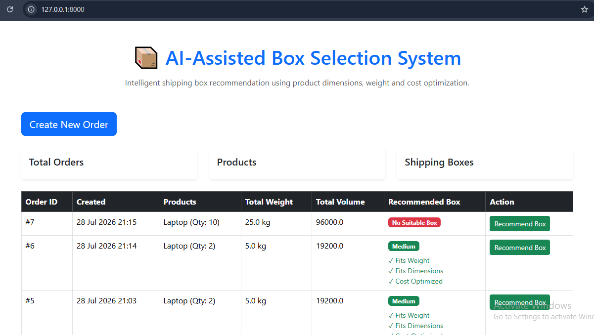
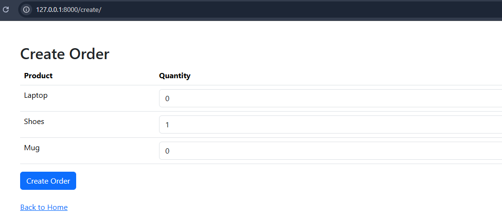
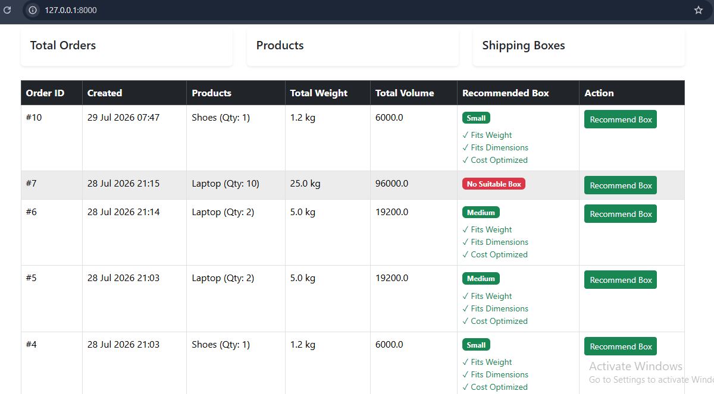
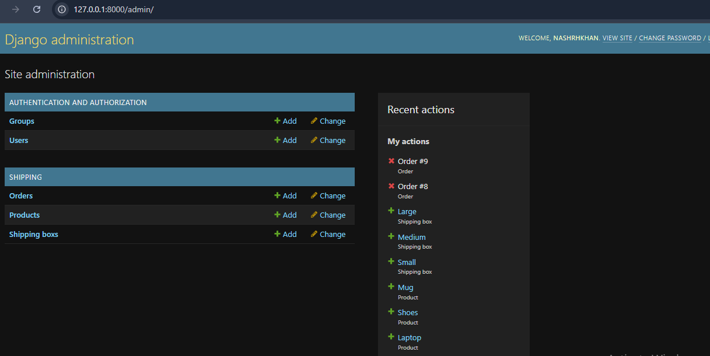

# 📦 AI-Assisted Box Selection System

## Overview

The AI-Assisted Box Selection System is a Django-based web application that recommends the most suitable shipping box for an e-commerce order based on product dimensions, weight, and shipping box specifications.

The system helps warehouse staff quickly identify the best box by evaluating available boxes and selecting the one that satisfies weight and dimension requirements while minimizing shipping cost and unused space.

---

## Features

- Add products with dimensions and weight.
- Add shipping boxes with dimensions, weight capacity, and cost.
- Create customer orders.
- Add multiple products to an order.
- Automatically recommend the most suitable shipping box.
- Django Admin Panel for managing products, orders, and boxes.
- Bootstrap-based responsive user interface.
- Intelligent recommendation algorithm based on:
  - Product dimensions
  - Product weight
  - Box dimensions
  - Maximum box weight
  - Shipping cost
  - Unused internal volume

---

## Technologies Used

- Python 3
- Django
- SQLite
- HTML5
- Bootstrap 5
- CSS

---

## Project Structure

```
AI_Box_Selection/
│
├── config/
├── shipping/
│   ├── migrations/
│   ├── services/
│   │   ├── __init__.py
│   │   └── box_selector.py
│   ├── templates/
│   │   └── shipping/
│   ├── admin.py
│   ├── forms.py
│   ├── models.py
│   ├── urls.py
│   ├── views.py
│   └── tests.py
│
├── manage.py
├── db.sqlite3
├── requirements.txt
└── README.md
```

---

## Installation

### 1. Clone the repository

```bash
git clone <repository-url>
```

### 2. Navigate into the project

```bash
cd AI_Box_Selection
```

### 3. Create a virtual environment

```bash
python -m venv venv
```

### 4. Activate the virtual environment

Windows

```bash
venv\Scripts\activate
```

Linux/macOS

```bash
source venv/bin/activate
```

### 5. Install dependencies

```bash
pip install django
```

or

```bash
pip install -r requirements.txt
```

### 6. Apply migrations

```bash
python manage.py migrate
```

### 7. Create an admin user

```bash
python manage.py createsuperuser
```

### 8. Run the development server

```bash
python manage.py runserver
```

Open your browser and visit:

```
http://127.0.0.1:8000/
```

Admin Panel:

```
http://127.0.0.1:8000/admin/
```

---

## How the Recommendation Works

The recommendation engine follows these steps:

1. Calculate the total weight of the order.
2. Calculate the total volume of the order.
3. Check each shipping box.
4. Verify the box can support the total weight.
5. Verify the box has enough internal volume.
6. Check whether each product can physically fit inside the box.
7. Calculate a score using:
   - Shipping cost
   - Remaining unused volume
   - Weight utilization
8. Recommend the box with the lowest score.

---

## Example Data

### Products

| Product | Length | Width | Height | Weight |
|----------|--------|-------|--------|--------|
| Laptop | 40 | 30 | 8 | 2.5 |
| Shoes | 30 | 20 | 10 | 1.2 |
| Mug | 10 | 10 | 12 | 0.5 |

### Shipping Boxes

| Box | Length | Width | Height | Max Weight | Cost |
|------|--------|-------|--------|------------|------|
| Small | 35 | 25 | 15 | 3 | 2.50 |
| Medium | 45 | 35 | 20 | 8 | 4.00 |
| Large | 60 | 40 | 40 | 20 | 7.00 |

---

## Future Improvements

- Product images
- Advanced 3D bin-packing algorithm
- Order history
- Search and filtering
- REST API
- Docker support
- User authentication
- Packing visualization
- Cost estimation dashboard

---

## Testing

Run the automated tests:

```bash
python manage.py test
```

---

## Screenshots

### Home Page



### Create Order



### Recommendation



### Django Admin



---

## Author

**Nashrh Khan**

Computer Science Engineering Graduate (2025)

Python | Django | Web Development